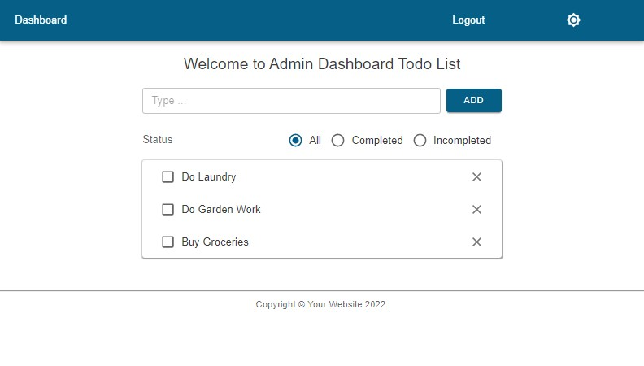

# NextAuth & Firebase/Firestore

## The idea behind the example

Authentication and data storage updates are two of the most challenging aspects of program development. For our project app, we'll create an admin dashboard Todo app using [Firestore](https://firebase.google.com/docs/firestore/quickstart) cloud database and to prevent unauthorized access to the admin dashboard, we will be utilizing [NextAuth](https://next-auth.js.org/), [Next.js 12 middleware](https://nextjs.org/docs/advanced-features/middleware) and [Firebase](https://firebase.google.com/) authentication services. The user can login to our dashboard and perform real-time database operations with our Todo app. To see what we'll be creating, check out the app for the completed [project app](https://next-firebase-auth-kappa.vercel.app/).

## Feedback

Please leave a message on my portfolio website. Your comments are always appreciated and aid my quest for knowledge.
[https://tamvo.vercel.app/](https://tamvo.vercel.app/)

[Live App Example - https://next-firebase-auth-kappa.vercel.app/](https://next-firebase-auth-kappa.vercel.app/)



## Starter project

This project app is based on the starter [Next.js & MUI 5 Light/Dark Mode Theme & TypeScript example](https://github.com/tamvo22/mui-v5-theme).

## Objective

This project's objective consists of two main components: 1) authentication service, 2) database updates after successfully authenticated. In order to achieve this goal, we would need to do the following:

- Setup environment variables

- Customize our login page and components

- Initialize and configure NextAuth

- Initialize Firebase and Firebase Admin

- Implement Firebase Auth and Firebase Admin Auth

- Implement Firebase Admin Firestore API methods for NextAuth adapter

- Utilize Next.js middleware to prevent unauthorized access to private pages

- Implement Firebase Firestore client authoriziation with custom accessToken

- Create Todo and firebase/firestore API methods to perform CRUD operations

## Typescript type checking

One of the challenges in using Typescript is learning how to differentiate custom types. We can filter the variables based on the types that are known by using the helper script [isTypeof](https://stackoverflow.com/questions/51528780/typescript-check-typeof-against-custom-type).

[typeGuard.ts](src/_utils/helper/typeGuard.ts)

```jsx
export const isTypeOf = <T>(varToBeChecked: any, propertyToCheckFor: keyof T): varToBeChecked is T => (varToBeChecked as T)[propertyToCheckFor] !== undefined;
```

[login.tsx](pages/login/index.tsx)

```jsx
//pages/login/index.tsx

// Perform type guard for UserCredential type and Error
if (isTypeOf < UserCredential > (auth, 'user')) {
  // handle Auth typeof 'user'
} else {
  // handle Auth typeof 'Error'
}
```

In addition, defining type augmentation to the [next-auth.d.ts](src/_types/next-auth.d.ts) and [next.d.ts](src/_types/next.d.ts) files will allow our app to recognize the custom NextAuth interface while passing the session variable to our \_app pageProps props.

[\_app](pages/_app.tsx)

```jsx
// pages/_app.tsx
type MyAppProps = AppProps<{
  session?: Session,
}> & {
  Component: NextPageWithLayout,
  emotionCache?: EmotionCache,
};
```

## Let's get started

### Setup environment variables

Application authentication has never been simpler. Fortunately, with NextAuth assisting us with the various authentication options as well as session state management, the authentication process is greatly simplified. The first task of operation is to configure the following environment variables: _NextAuth environment variables_, _Github and Google Auth0 provider API keys_, and _Firebase/Firebase Admin Service Accounts_.

[.env](.env)

- **NEXTAUTH_URL**: set to `http://localhost:3000` for local development. It is important to update this to your live server url for production. You can check [NextAuth configuration](https://next-auth.js.org/configuration/options) for more information.

- **NEXTAUTH_SECRET**: private secret key used for JWT session encryption. You can use the [Vercel secret generator](https://generate-secret.vercel.app/32) tool to generate a secret key.

- **GITHUB_ID and GITHUB_SECRET**: [Github account settings](https://github.com/settings/) > OAuth Apps is where you can find this information. We will need to set the authorized home page and callback urls to allow calls from the NextAuth Github provider API.

  - Homepage URL: `http://localhost:3000`
  - Authorization callback URL: `http://localhost:3000/api/auth/callback/github`

- **GOOGLE_ID and GOOGLE_SECRET**: configure this information from the [Google Console](https://console.cloud.google.com/apis/credentials) > OAuth 2.0. We must provide the authorized and callback urls to allow calls from the NextAuth Google provider API.

  - Authorized JavaScript origins: `http://localhost:3000`
  - Authorized redirect URIs: `http://localhost:3000/api/auth/callback/google`

- **Firebase Auth App**: create a new [Google Project App](https://console.firebase.google.com/) to get the PROJECT_ID, API_KEY, and APP_ID needed to initialize firebase. We only need the following public variable information for our app.

  - FIREBASE_PROJECT_ID=
  - FIREBASE_API_KEY=
  - FIREBASE_APP_ID=

- **Firebase Admin**: create a Firebase Service Account either from the [Google Project](https://console.firebase.google.com/) settings or [Google Console](https://console.cloud.google.com/apis/credentials) > Service Accounts to get the CLIENT_EMAIL and PRIVATE_KEY.

  - FIREBASE_ADMIN_CLIENT_EMAIL=
  - FIREBASE_ADMIN_PRIVATE_KEY=

_The environment variables listed below will be configured as public variables to be used on the client side in our next.config file._

[next.config.mjs](next.config.mjs)

```jsx
// next.config.mjs
  env: {
    NEXTAUTH_URL: process.env.NEXTAUTH_URL,
    FIREBASE_PROJECT_ID: process.env.FIREBASE_PROJECT_ID,
    FIREBASE_API_KEY: process.env.FIREBASE_API_KEY,
    FIREBASE_APP_ID: process.env.FIREBASE_APP_ID,
  },
```

### Customize our login page and components

The two components that make up our [Login page](pages/login/index.tsx) are the **Provider** component, which has the callback function *handleSignInProvider* to authenticate with Google and GitHub Auth0 media provider and the **CredentialForm** component, which is a custom credential login form with form submit function *handleOnSubmit* to authenticate with Firebase Auth. In getServerSideProps, we will perform a check to redirect the user to the Dashboard if a session already exists. Otherwise, we will generate a CSRF token for our custom credential login form for validation. Most of the code will be for the custom credential form. After integrating Firebase into later in our app, we will revisit the **handleOnSubmit** function to continue with Firebase credential login process.

[login.tsx](pages/login/index.tsx)

```jsx
// pages/login/index.tsx
const handleSignInProvider = async (event: React.MouseEvent<HTMLButtonElement>, providerId: string) => {
  event.preventDefault();
  // reset error message
  formErrorSet(undefined);

  await signIn(providerId, {
    callbackUrl: `${Server}/dashboard`,
  });
};

// handle CredentialForm
async function handleOnSubmit(event: React.FormEvent<HTMLFormElement>) {
  // reset error message
  event.preventDefault();
  formErrorSet(undefined);

  const email = event.currentTarget.email.value;
  const password = event.currentTarget.password.value;

  // send email and password to Firebase for authentication
  // Then send the return token to NextAuth API for authorization
}

export const getServerSideProps: GetServerSideProps = async (context) => {
  const session = await getSession(context);

  // redirected to dashboard if user already have a session
  if (session) {
    return {
      redirect: {
        destination: '/dashboard',
        permanent: false,
      },
    };
  }

  // initiate csrfToken and provider list
  const csrfToken = await getCsrfToken(context);
  const providers = await getProviders();
  return {
    props: { csrfToken, providers },
  };
};
```

### Initialize and configure NextAuth

We will initialize and configure the NextAuth API route handler [`[...nextauth.js]`](pages/api/auth/%5B...nextauth%5D.ts) to perform both credential login and media provider account logins. You can find more information on the [NextAuth website](https://next-auth.js.org/) for additional configuration information. NextAuth will use the NEXTAUTH URL and NEXTAUTH SECRET environment variables to route and encrypt our JWT session. The API route handler consists of the following properties:

- **providers**: configuration for GithubProvider, GoogleProvider, and CredentialsProvider. We will integrate server firebase-admin/auth into the CredentialsProvider after we initialize Firebase Admin SDK.

- **adapter**: database connector to store our media provider authenticated user account information. This does not apply to custom credential signin and we would have to handle that separately.

- **session**: We will use an encrypted JWT session cookie instead of the database session option.

- **pages**: corresponding pages for the login process.

- **callbacks**: provide extra control during the authentication phrase. We can configure any parameters we need to pass along with our JWT token, such as user role, custom claims, rotating accessToken and refreshToken in the Session callback.

[`[...nextauth].js`](pages/api/auth/%5B...nextauth%5D.ts)

```jsx
// pages/api/auth/[...nextauth].js
export default NextAuth({
  providers: [
    CredentialsProvider({
      id: 'firebase-credential', // referense multiple credential login option by id
      name: 'Credentials',
      credentials: {
        // declare credential object
        auth: { label: 'auth', type: 'text' },
      },
      async authorize(credentials, req) {
        const authUser = JSON.parse(credentials?.auth!);
        // perform custom authentication
      },
    }),
    // Auth0 Providers
    GithubProvider({
      clientId: process.env.GITHUB_ID,
      clientSecret: process.env.GITHUB_SECRET,
      // @ts-ignore
      scope: 'read:user',
      profile(profile) {
        return {
          id: profile.id,
          name: profile.name ?? profile.login,
          email: profile.email!,
          image: profile.avatar_url,
        };
      },
    }),
    GoogleProvider({
      clientId: process.env.GOOGLE_ID!,
      clientSecret: process.env.GOOGLE_SECRET!,
      profile(profile) {
        return {
          id: profile.sub,
          name: profile.name,
          email: profile.email,
          image: profile.picture,
        };
      },
    }),
  ],
  //connect to our database to store authentication information such as User and Account information
  adapter: FirestoreAdapter(), // We will implement the FirestoreAdapter() function later on
  session: {
    strategy: 'jwt',
  },
  pages: {
    signIn: '/login',
    signOut: '/login',
    error: '/login',
  },
  callbacks: {
    async jwt({ token, user }) {
      if (user) {
      // we will be adding firestore custom accessToken later on
        token.user = { ...user };
      }

      return token;
    },
    async session({ session, token }) {
      session = { ...session, ...token };

      return session;
    },
  },
});
```

### Initialize Firebase and Firebase Admin

[Firebase](https://firebase.google.com/docs/) consist of two SDKs: *Firebase Admin SDK*, which functions on the server, and *Firebase Client SDK* runs on the client side. Each has individual modules for both *authication (Auth)* and *firesore*. To differentiate the two SDKs better, I've referenced them by their namespace: firebase/auth, firebase-admin/auth, firebase/firestore, and firebase-admin/firestore.

- [**Firebase Client Auth** (firebase/auth)](https://firebase.google.com/docs/auth): perform client authentication and on passing userIdToken to the server for additional validation.

- [**Firebase Admin Auth** (firebase-admin/auth)](https://firebase.google.com/docs/auth/admin): validation user authentication and create custom accessToken to access Firestore on the client.

- [**Firebase Client Firestore** (firebase/firestore)](https://firebase.google.com/docs/firestore): provide direct client access to Firestore API for data updates. We will have to set additional [Firestore security rules](https://firebase.google.com/docs/rules) for client-side access.

- [**Firebase Admin Firestore** (firebase-admin/firestore)](https://firebase.google.com/docs/reference/admin/node/firebase-admin): provide server side access to Firestore API data updates used in our [NextAuth FirestoreAdapter](src/_utils/auth/firestoreAdapter.ts). Firebase Admin doesn't require additional [Firestore security rules](https://firebase.google.com/docs/rules).

Firebase SDK implementations currently consist of version 8 and version 9, the latest version being version 10. Compared to Firebase v8, [Firebase version 9's](https://firebase.google.com/docs/web/modular-upgrade) provides a modular 'tree-shaking', which greatly improves the app's bundle size and speed. We will be using Firebase V9 in our app.

The boiler codes provided in [_initFirebase.ts_](src/_utils/firebase-v9/firebase/initFirebase.ts) and [_initFirebaseAdmin.ts_](src/_utils/firebase-v9/firebase-admin/initFirebaseAdmin.ts) will help us initiate Firebase into our app, and we only need to supply the required environment variables. You can learn more about [Firebase Setup ](https://firebase.google.com/docs/web/setup) and [Firebase Admin Setup](https://firebase.google.com/docs/admin/setup) docs.


### Implement Firebase Auth and Firebase Admin Auth

We will create the [**useAuth**](src/_utils/firebase-v9/firebase/useAuth.ts) file, which contains Firebase Client Auth API functions to assist client authentication for our Login custom credential form. We'll be using two API methods: **signInWithEmailAndPassword()**, which authenticates the user's email and password; and **getIdToken()**, which generates the Firebase *userIdToken* after a successful sign in to send to NextAuth api route for additional validation.

In addition, since NextAuth will be handling the session management, it is important that we disable [Firebase Auth's persistent state management](https://firebase.google.com/docs/auth/web/auth-state-persistence) and let NextAuth handle the session state management instead.

[useAuth.ts](src/_utils/firebase-v9/firebase/useAuth.ts)

```jsx
// src/_utils/firebase-v9/firebase/useAuth.ts
import firebaseApp from '@/utils/firebase-v9/firebase/initFirebase';
import { initializeAuth, inMemoryPersistence, UserCredential, signInWithEmailAndPassword, createUserWithEmailAndPassword, signOut as fbSignOut } from 'firebase/auth';

// disable Firebase persistent session state management
export const fbAuth = initializeAuth(firebaseApp, { persistence: [inMemoryPersistence] });

export const getIdToken = async () => {
  return await fbAuth.currentUser!.getIdToken(true).catch((error) => null);
};

export const signIn = async (email: string, password: string): Promise<UserCredential | string> => {
  return await signInWithEmailAndPassword(fbAuth, email, password).catch((error) => {
    switch (error.code) {
      case 'auth/user-not-found':
        return 'Incorrect email';
      case 'auth/wrong-password':
        return 'Incorrect password';
      case 'auth/too-many-requests':
        return 'Your account is locked due to too many attempts.';
      default:
        return 'Incorrect username or password';
    }
  });
};

export const signUp = async (email: string, password: string) => {
  return await createUserWithEmailAndPassword(fbAuth, email, password).catch((error) => ({ error: error }));
};

export const signOut = async () => {
  return await fbSignOut(fbAuth).catch((error) => ({ error: error }));
};

```

We will revisit the [Login page's **handleOnSubmit** function](pages/login/index.tsx#L68) to call *signIn()* with the email and password for our credential signin. Upon a successful login, we will call *getIdToken()* to get the userIdToken to pass it to the server using [NextAuth **signIn()**](https://next-auth.js.org/getting-started/client#signin) method for additional validation and user session creation.

For the Firebase authentication with email and password credential sign-in, the user must have a Firebase Auth account. We'll be adding the admin account manually for the purpose of this project app. To create separate users who will use the credential signin method, you would need to create a signup page or an internal user creation page. 

[login.tsx](pages/login/index.tsx)

```jsx
// pages/login/index.tsx
import { signIn as fbSignIn, getIdToken } from '@/utils/firebase-v9/firebase/useAuth';

...

const handleOnSubmit = async (event: React.FormEvent<HTMLFormElement>) => {
  // reset error message
  event.preventDefault();
  formErrorSet(undefined);

  const email = event.currentTarget.email.value;
  const password = event.currentTarget.password.value;

  // send email and password to Firebase for authentication
  // we would need to create Firebase authentication accounts for credential users signup
    const fbAuth = await fbSignIn(email!, password!);

  // Perform type guard for UserCredential type and Error
  if (isTypeOf<UserCredential>(auth, 'user')) {
    // get Firebase authentication userIdToken after a successfull authentication
    const userIdToken = await getIdToken();

    if (userIdToken) {
      const user = JSON.stringify({
        ...fbAuth.user,
        userIdToken: userIdToken,
      });

      // send the return token to NextAuth API for authorization
      await signIn('firebase-credential', {
        redirect: true,
        auth: user,
        callbackUrl: `${Server}/dashboard`,
      });
    } else {
      // invalid token error
      formErrorSet('Sign in failed');
    }
  } else {
    // set firebase sign in errors
    formErrorSet(fbAuth);
  }
}
```

### Implement Firebase Admin Firestore API methods for NextAuth adapter

We would need to implement Firestore Admin modules needed for NextAuth credential authorization and a NextAuth adapter to connect to our Firestore database for storing provider authenticated user information. You can refer to [Firestore manage data docs](https://firebase.google.com/docs/firestore/manage-data/add-data?hl=en&authuser=0) for additional information on how to perform Firestore get, add, update, and delete operations.

- [useAuth.ts](src/_utils/firebase-v9/firebase-admin/useAuth.ts): We will need the verifyIdToken method to verify the Firebase token sent from the credential signin provider method.

```jsx
// src/_utils/firebase-v9/firebase-admin/useAuth.ts
export async function verifyIdToken(idToken: string) {
  let checkRevoked = true;
  return await adminAuth
    .verifyIdToken(idToken, checkRevoked)
    .then((decodedToken) => {
      return decodedToken;
    })
    .catch((error) => {
      return error;
    });
}
```

- [useUsers.ts](src/_utils/firebase-v9/firebase-admin/firestore/useUsers.ts): contains the Firestore Admin methods to access the Users documents. The available methods are:

  - addUser: add a new user to the Users collection and return the new user's data and its document id.
  - getUser: gets the user with the specific document id.
  - getUserByEmail: perform a query and return the first user document matches the email.
  - updateUser: update and overwrite the existing user document.
  - deleteUser: permanently deletes the user document if it exists.

```jsx
// src/_utils/firebase-v9/firebase-admin/firestore/useUsers.ts
import { docToObj, querySingleToObj } from '@/utils/firebase-v9/firestoreHelper';
import { AdapterUser, Users } from '@/utils/firebase-v9/firebase-admin/firestore/collections';

export const addUser = async (user: Omit<AdapterUser, 'id'>): Promise<AdapterUser> => {
  const { id } = await Users.add(user as any);
  return { ...user, id } as AdapterUser;
};

export const getUser = async (id: string): Promise<AdapterUser | null> => {
  return await Users.doc(id)
    .get()
    .then((doc) => docToObj(doc));
};

export const getUserByEmail = async (email: string) => {
  const ref = Users.where('email', '==', email).limit(1);
  return await ref.get().then((query) => querySingleToObj(query));
};

export const updateUser = async (user: Partial<AdapterUser>) => {
  const { id, ...data } = user;
  await Users.doc(id!).update(data as {});
  return await Users.doc(id!)
    .get()
    .then((doc) => docToObj(doc));
};

export const deleteUser = async (id: string) => {
  await Users.doc(id!).delete();
};
```
- [useAccounts.ts](src/_utils/firebase-v9/firebase-admin/firestore/useAccounts.ts): contains the Firestore Admin methods to access the Accounts documents.

  - addAccount: add a new account to the Accounts collection and return the new account's data and its document id.
  - getAccount: performs a query to find the first document containing the provider name and id.
  - deleteAccount: perform a query similar to getAccount() to get the account and delete it.
  - deleteAccountByUserId: perform a query to delete a user by the userId

```jsx
  // src/_utils/firebase-v9/firebase-admin/firestore/useAccounts.ts
import { querySingleToObj } from '@/utils/firebase-v9/firestoreHelper';
import { firestoreAdmin, AdapterAccount, Accounts } from '@/utils/firebase-v9/firebase-admin/firestore/collections';

export const addAccount = async (account: AdapterAccount) => {
  const { id } = await Accounts.add(account);
  return { ...account, id } as AdapterAccount;
};

export const getAccount = async ({ provider, providerAccountId }: { provider: string; providerAccountId: string }) => {
  const ref = Accounts.where('provider', '==', provider).where('providerAccountId', '==', providerAccountId).limit(1);
  return await ref.get().then((query) => querySingleToObj(query));
};

export const deleteAccount = async ({ provider, providerAccountId }: { provider: string; providerAccountId: string }) => {
  const ref = Accounts.where('provider', '==', provider).where('providerAccountId', '==', providerAccountId).limit(1);
  const accountDocs = await ref.get();

  if (accountDocs.empty) return;
  await firestoreAdmin.runTransaction(async (transaction) => {
    transaction.delete(accountDocs.docs[0]?.ref!);
  });
};

export const deleteAccountByUserId = async (userId: string) => {
  const ref = Accounts.where('userId', '==', userId);
  const accountDocs = await ref.get();

  if (accountDocs.empty) return;
  await firestoreAdmin.runTransaction(async (transaction) => {
    accountDocs.forEach((account) => transaction.delete(account.ref));
  });
};
```

In addition, we will be using the [Google Firestore Data Converter withConvert API](https://firebase.google.com/docs/reference/js/v8/firebase.firestore.FirestoreDataConverter) to specify our data types for our data storage.

[collections.ts](src/_utils/firebase-v9/firebase-admin/firestore/collections.ts)

```jsx
const COLLECTIONS = {
  users: 'users',
  sessions: 'sessions',
  accounts: 'accounts',
  verificationTokens: 'verificationTokens',
};

export const converter = <T>() => ({
  toFirestore: (data: T) => data,
  fromFirestore: (snapshot: QueryDocumentSnapshot<T>): T => {
    return snapshot.data();
  },
});

export type { AdapterAccount, AdapterSession, AdapterUser, VerificationToken };

export const Accounts = firestoreAdmin.collection(COLLECTIONS.accounts).withConverter<AdapterAccount>(converter<AdapterAccount>());
export const Sessions = firestoreAdmin.collection(COLLECTIONS.sessions).withConverter<AdapterSession>(converter<AdapterSession>());
export const Users = firestoreAdmin.collection(COLLECTIONS.users).withConverter<AdapterUser>(converter<AdapterUser>());
export const VerificationTokens = firestoreAdmin.collection(COLLECTIONS.verificationTokens).withConverter<VerificationToken>(converter<VerificationToken>());

```

After implementing our Firestore Admin functions, we will create our own custom [NextAuth Firestore adapter](src/_utils/auth/next-auth/FirestoreAdapter.ts). The adapter will allow us to save provider authenticated user information such as users and accounts to our Firestore database. NextAuth provides us with the [custom adapter methods](https://next-auth.js.org/tutorials/creating-a-database-adapter) so that we may add calls to our Firestore useUsers and useAccounts module to carry out the required operations. Since we are using JWT session and don't need to record the session information, we can return null for the adapter session and email validation methods. As a note, the NextAuth adapter only 

[firestoreAdapter.ts](src/_utils/auth/firestoreAdapter.ts)

```jsx
//src/_utils/auth/firestoreAdapter.ts
export function FirestoreAdapter(): Adapter {
  const fsUsers = useUsers();
  const fsAccounts = useAccounts();

  return {
    async createUser(user) {
      return (await fsUsers.addUser(user)) as AdapterUser;
    },
    async getUser(id) {
      const user = await fsUsers.getUser<AdapterUser>(id);

      return user ? user : null;
    },
    async getUserByEmail(email) {
      const result = await fsUsers.getUserByEmail<AdapterUser>(email);
      return result;
    },
    async getUserByAccount({ provider, providerAccountId }) {
      const account = await fsAccounts.getAccount<Account>({ provider, providerAccountId });
      if (!account) return null;

      const user = await fsUsers.getUser<AdapterUser>(account?.userId!);
      return user ? user : null;
    },
    async updateUser(partialUser) {
      const user = await fsUsers.updateUser<AdapterUser>(partialUser);

      return user!;
    },
    async deleteUser(userId) {
      await fsUsers.deleteUser(userId);
      await fsAccounts.deleteAccountByUserId(userId);

      return null;
    },
    async linkAccount(account) {
      return (await fsAccounts.addAccount<Account>(account)) as Account;
    },
    async unlinkAccount({ provider, providerAccountId }) {
      await fsAccounts.deleteAccount({ provider, providerAccountId });
    },
    ...
  };
}
```

Let's revisit the nextauth api route **CredentialsProvider** authorize function and add the finishing touches to complete our NextAuth api route handler. We'll use the verifyIdToken api function to validate the Firebase client userIdToken before passing it to NextAuth to create the session. We can fetch our user's profile from our database, such as the Name and Role fields, to add to our user token.

[`[...nextauth].ts`](pages/api/auth/%5B...nextauth%5D.ts)

```jsx
// pages/api/auth/[...nextauth].ts
CredentialsProvider({
  id: 'firebase-credential',
  name: 'Credentials',
  credentials: {
    auth: { label: 'auth', type: 'text' },
  },
  async authorize(credentials, req) {
    const authUser = JSON.parse(credentials?.auth!);

    //Verify firebase access_token with verifyIdToken
    const isValidUser = await verifyIdToken(authUser.userIdToken);

    if (isValidUser) {
      // fetch user database profile such as name and role to add to our user token
      const profile = await getUser(isValidUser.uid);

      const user: User = {
        id: authUser.uid,
        name: profile?.name!,
        role: profile?.role!,
        email: authUser.email,
        image: authUser.image,
        emailVerified: authUser.emailVerified,
      };

      return user;
    } else {
      return null;
    }
  },
  adapter: FirestoreAdapter(),
})
```

### Utilize Next.js middleware to prevent unauthorized access to private pages

Securing our private [dashoard page](pages/dashboard/index.tsx) will be the last step in the authentication process. Since [middleware was introduced in Next.js 12](https://nextjs.org/docs/advanced-features/middleware), we will take advantage of it to secure our private pages. We will use [getToken](https://next-auth.js.org/configuration/options#jwt-helper) in our middleware to check the request token's validity before either sending the user back to the login page or allowing them access to the dashboard.

[middleware.ts](middleware.ts)

```jsx
// middleware.ts
type NextMiddleWareProps = NextApiRequest & Pick<NextRequest, 'nextUrl' | 'cookies'>;

const isSecure = process.env.NEXTAUTH_URL?.startsWith('https://') ?? !!process.env.VERCEL_URL;

export async function middleware(req: NextMiddleWareProps) {
  if (req.nextUrl.pathname.startsWith('/dashboard')) {
    const session = await getToken({
      req,
      secureCookie: isSecure,
    });

    if (!session) {
      return NextResponse.redirect(new URL('/login', req.url));
    }
  }
}

export const config = {
  matcher: '/dashboard/:path*',
};
```

### Implement Firebase Firestore client authoriziation with custom accessToken

Our Todo app will access our Firestore database directly to perform database updates. This process is much faster than performing server updates with firebase-admin/firestore. However, we would need to authorize the authenticated user with a custom accessToken with firebase/firestore. We can do that using firebase-admin/auth's createCustomToken() api method to generate our accessToken and pass it along with our user session.

[`[...nextauth].ts`](pages/api/auth/%5B...nextauth%5D.ts)

```jsx
// pages/api/auth/[...nextauth].ts
callbacks: {
    async jwt({ token, user }) {
      if (user) {
        const uid = user.id || token.sub;
        // create firestore accessToken
        const accessToken = await adminAuth.createCustomToken(uid);
        token.user = { ...user, accessToken };
      }

      return token;
    },
    async session({ session, token }) {
      session = { ...session, ...token };

      return session;
    },
  },
```

Instead of having our Todos app accessing our server api to communicate with our Firestore database the long way, we can communicate with our Firebase database directly. We will use firebase/auth's **signInWithCustomToken()** to authorize our session's accessToken. In addition, since we will be signing in to firebase/firestore and subscribing to our Todo data updates, it's best to create a [**firestore context provider**](src/_utils/firebase-v9/firebase/firestore/firestoreContext.tsx) to keep track of our firestore states, because we will need to unsubscribe to the active listeners and sign out of firebase/firestore when we sign out of our app.

Our app's layout component will be the best place to check for user sessions, and if the user is authenticated, the admin dashboard header will be used to authorize with firebase/firestore and update our firestore context. Our admin dashboard header also contains the Signout method to handle the Signout process.

[layout.tsx](src/components/layout/index.tsx)

```jsx
const { fsState, setFsState } = useContext(FirestoreContext);

useEffect(() => {
  if (session) {
    // authenticate with firestore for access to resource
    signInWithCustomToken(fbAuth, session?.user?.accessToken).then(() => {
      // save firestore authenticated state
      setFsState((prev) => ({ ...prev, authenticated: true }));
    });
  }
}, [session]);

function handleSignOut() {
  signOut({ callbackUrl: server + '/login' });

  // remove all active listeners, reset firestore state 
  fsState.listeners.forEach((subscriber) => subscriber());
  setFsState({ authenticated: false, listeners: [] });

  //logout of firestore
  fsSignOut(fbAuth);
}

```


### Create Todo and firebase/firestore API methods to perform CRUD operations

Now that we're authenticated and have access to our dashboard, let's make a Todo component so that we can utilize firestore/firebase API methods to perform CRUD operations on our Firestore database.

[TodoList.tsx](src/components/ui/TodoList/index.tsx)

```jsx
  // src/components/ui/TodoList.tsx
const TodoList = () => {
  const [filter, setFilter] = useState<string>('all');

  const fsTodo = useTodos();

  const filtedTodo = useMemo(() => {
    if (filter === 'all') return fsTodo.todos;
    else if (filter === 'completed') return fsTodo.todos?.filter((todo) => todo.completed);
    else return fsTodo.todos?.filter((todo) => !todo.completed);
  }, [filter, fsTodo.todos]) as Todo[];

  const handleAddTodo = (event: React.FormEvent<HTMLFormElement>) => {
    event.preventDefault();
    const name = event.currentTarget.addTodo.value.trim();
    event.currentTarget.addTodo.value = '';

    if (name) {
      const newTodo = { name, completed: false, createAt: new Date() };
      fsTodo.add(newTodo);
    }
  };

  const handleSetTodo = (action: string, todo: Partial<Omit<Todo, 'createAt'>> & Required<{ id: string }>) => {
    if (action === 'UPDATE') {
      const { id, ...rest } = todo;
      fsTodo.update(id, rest);
    } else if (action === 'DELETE') {
      fsTodo.delete(todo.id);
    }
  };

    return (
    <form onSubmit={handleAddTodo}>
      <Grid container spacing={1} alignItems="center">
        ...
      </Grid>
      <Filter filter={filter} setFilter={setFilter} />
      {fsTodo.loading ? <LinearProgress /> : null}
      <Paper>
        {filtedTodo?.length > 0 ? (
          <TransitionGroup>
            {filtedTodo?.map((todo) => (
              <Collapse key={todo.id}>
                <TodoItem todo={todo} setTodo={handleSetTodo} />
              </Collapse>
            ))}
          </TransitionGroup>
        ) : (
          <TodoDiv>No Todo...</TodoDiv>
        )}
      </Paper>
    </form>
  );
};
```

Now all we need to do is create the firebase/firestore api methods to handle our todos CRUD (*Create, Read, Update, Delete*) operations. Our **useTodos** will subscribe to Firestore *onSnapsot()* subscription perform real-time data updates to our Firestore database. In addition, we would need to add the subscription listener to our firestore context state so that we can unsubscribe the active listeners before logging out of the Firestore. Firestore will return a "permission-denied" error if we sign out but don't terminate the listeners.

[useTodos.ts](src/_utils/firebase-v9/firebase/firestore/useTodos.ts)

```jsx
// src/_utils/firebase-v9/firebase/firestore/useTodos.ts
export default function useTodos() {
  const [todos, setTodos] = useState<Todo[]>([]);
  const [loading, setLoading] = useState(false);

  const { fsState, setFsState } = useContext(FirestoreContext);

  // pass the session.user.id to the the Todo's uid to distinguish the user's todo
  const { data } = useSession();

  useEffect(() => {
    setLoading(true);
    const q = query(Todos(), where('uid', '==', data?.user.id), orderBy('createAt', 'desc'));
    const todoSubscriber = onSnapshot(q, (querySnapshot) => {
      const res = queryToObjs(querySnapshot);
      setTodos(res);
      setLoading(false);
    });

    // add todoLister to the list of firestore listeners
    setFsState((prev) => ({ ...prev, listeners: [...fsState.listeners, todoSubscriber] }));

    return () => {
      todoSubscriber();
    };
  }, []);

  return {
    todos,
    loading,
    async add(todo: Omit<Todo, 'id' | 'uid'>) {
      const newDocRef = doc(Todos());
      await setDoc(newDocRef, { ...todo, uid: data?.user.id } as Omit<Todo, 'id'>);
    },
    async update(id: string, todo: Partial<Todo>) {
      await updateDoc(Todo(id), todo);
    },
    async delete(id: string) {
      await deleteDoc(Todo(id));
    },
  };
}
```


## Conclusion

Our Next.js & NextAuth & Firebase & Firestore project app is now completed. Despite being a bit lengthy, it does cover every aspect related to Firebase/Firestore authentication and Firestore database updates. I hope the project app is beneficial and encourages you to try out Google Cloud services. I'll continue to make an more unique and fun apps in the future.
